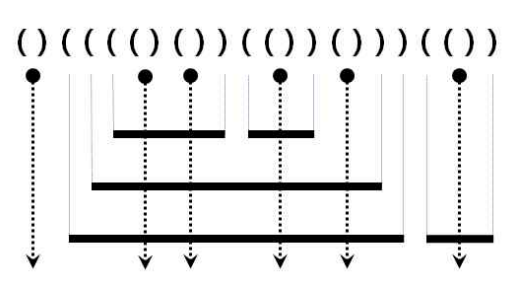

### [BOJ10799] 쇠막대기

### 문제 링크

[BOJ10799 - 쇠막대기](https://www.acmicpc.net/problem/10799)

### 문제 설명

`(`는 쇠막대기의 시작, `)`는 쇠막대기의 끝을 의미한다. `()`처럼 붙어있는 괄호는 레이저를 의미하는데, 레이저로 쇠막대기를 잘랐을 때 쇠막대기가 몇 조각이 나오는지를 출력하는 문제이다.

쇠막대기의 길이가 짧을수록 위에 존재하며, 쇠막대기끼리 양 끝점이 겹치지 않는다.

위의 그림에서 화살표는 레이저를 의미한다. 따라서 레이저로 쇠막대기를 잘랐을 때 17개의 조각이 나온다.

### 풀이 설명

`(`가 나오면 스택에 담는다.

스택의 크기는 쇠막대기의 갯수를 의미하는데, 레이저가 한번 자를 때 쇠막대기의 갯수만큼 조각이 생기니까 스택의 갯수만큼 `Answer`에 더해준다.

레이저를 의미하는 `()`의 여는 괄호도 스택에 담기는데 이는 별도의 조건으로 처리한다.
이전 인덱스 `i-1`가 `(` 이면서 현재 인덱스 `i`가 `)`라면 **레이저**로 처리한다.

이전 인덱스 `i-1`가 `)`가 이면서 현재 인덱스 `i`가 `)`라면 쇠막대기가 끝난 것을 의미한다.
쇠막대기가 끝난다는 것은 레이저가 자른 부분부터 또 하나의 조각이 생기는 것을 의미하기 때문에 `Answer`에 1을 더해준다.

### 풀이

