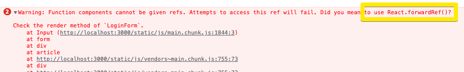

### [React] react-hook-form 사용시 발생하는 warning

폼 유효성 검사를 위해서 [react-hook-form](https://react-hook-form.com/)를 도입하였고,
[register API](https://react-hook-form.com/api/useform/register)를 사용하면서 아래와 같은 경고와 마주했다.

이 경고가 발생하는 이유와 해결법을 정리하고자 한다.



#### AS-IS

```jsx
const MyInput = ({ name, label, ...rests }) => {
  return (
    <InputContainer>
      <InputLabel htmlFor={name}>{label}</InputLabel>
      <InputBox
        id={name}
        name={name}
        {...rests}
      />
    </InputContainer>
  );
}

const MyForm = () => {
  const { register } = useForm(); // react-hook-form

  return (
    <form>
      <MyInput type="password" placeholder="비밀번호" {...register('password')}>
    </form>
  )
}
```

원인을 파악하기 위해서는 먼저 `register API`가 어떻게 동작하는지 살펴볼 필요가 있다. register 함수는 react-hook-form의 `useForm`의 반환값으로 얻을 수 있다. register 함수에 `input name`을 비롯한 옵션을 파라미터로 하여 호출하면 아래와 같은 값을 반환한다.

```jsx
const { onChange, onBlur, name, ref } = register('input_name', configOptionObject);
```

따라서 위의 코드에서 register함수가 반환한 값을 spread operator를 이용하여 Styled Input의 props로 전달해주는 것이다.
이렇게 register함수 내부에서 생성한 ref가 input에 부착되어 폼 유효성 검사가 진행되는 것인데, AS-IS의 `StyledInput` 컴포넌트 구조를 보면 HTML input 요소로 ref가 전달이 되지 않았음을 알 수 있다.

경고 메시지를 통해서 forwardRef는 prop으로 전달받은 ref를 컴포넌트 내부까지 전달할 수 있는 것이고, 이를 통해서 아래와 같이 변경하였다.

#### TO-BE

```jsx
const MyInput = React.forwardRef(({ name, label, ...rests }, ref) => {
  return (
    <InputContainer>
      <InputLabel htmlFor={name}>{label}</InputLabel>
      <InputBox
        id={name}
        name={name}
        ref={ref}
        {...rests}
      />
    </InputContainer>
  );
});

const MyForm = () => {
  const ref = useRef(null);
  const { register } = useForm(); // react-hook-form

  return (
    <form>
      <MyInput type="password" placeholder="비밀번호" {...register('password')}>
    </form>
  )
}
```

forwardRef는 prop으로 ref를 전달 받아서 하부 트리 내의 다른 컴포넌트로 전달하는 또 하나의 컴포넌트를 생성하는 역할을 한다.

> 참고자료

[React Hook Form - register](https://react-hook-form.com/api/useform/register)
[React - forwardRef](https://ko.reactjs.org/docs/react-api.html#reactforwardref)
