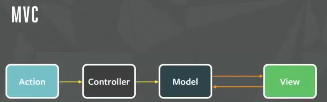

## Flux 패턴이란?

MVC 패턴의 문제점을 해결하기 위해서 페이스북이 고안한 아키텍쳐 설계 패턴이다. Flux 패턴은 데이터가 단방향으로 흐르게 해서 여러 데이터 갱신 작업이 한번에 하나의 데이터만 변경하도록 한다. 이를 통해서 여러 데이터가 한번에 변경되는 상황을 예방하여 데이터를 예측 가능하도록 하는 데에 목적이 있다.

## MVC 패턴의 문제점

Flux를 알아보기 전에 먼저 MVC 패턴에서 발생하는 문제를 알아보았다.

**MVC**는 **Model**, **View**, **Controller**로 이루어진다. 사용자의 액션이 발생하면 Controller가 Model을 업데이트하고, Model을 나타낼 View를 골라서 사용자에게 보여주는 방식으로 동작한다.

MVC의 각 구성 요소를 살펴보면, Controller는 View를 통해서 전달되는 사용자의 액션을 Model에 반영하고, 업데이트된 Model을 View에 반영하여 사용자에게 제공한다. Model과 View는 서로의 존재에 대해서 모르고, Controller가 이 둘을 연결하는 역할을 한다.

Model 데이터베이스와 정보를 주고 받으며, 사용자에게 필요한 데이터와 비즈니스 로직을 가진다. 사용자가 특정 페이지에 접근했을 때 보여주어야 하는 View에 표시할 데이터를 Controller를 통해서 전달한다.

View는 사용자에게 보여주는 화면 부분이다. View에서 사용자의 액션이 발생하고 Controller에게 전달되면 Controller는 이를 Model에 반영하는 역할을 한다.

---

Model과 View는 Controller를 통해서 양방향으로 데이터를 주고 받을 수 있다. 위의 이미지 처럼 애플리케이션의 규모가 커지면서 Model과 View의 수가 많아지면, Model과 View 둘 사이의 데이터 흐름이 매우 복잡해진다. 사용자의 액션으로 인해서 업데이트할 Model이 많아지고, 업데이트된 Model이 반영되어야 하는 View가 많아진다.

이렇게 복잡한 구조를 가지면 Model과 View 사이에 사이클이 생기고, 언제 어디서 데이터의 변경이 일어나는지 알기 어려워진다.

## Flux 패턴의 특징

위의 이미지와 같이, Flux 패턴은 MVC 패턴에서 발생하는 문제를 해결하기 위해 단방향 데이터 흐름을 채택한다. View에서 새로운 Action을 만들어서 Dispatcher를 통해서 Store 내부의 데이터를 변경하고, Store가 변경되면 바뀐 데이터를 바탕으로 View를 갱신한다.

Flux 패턴의 구성 요소를 하나씩 알아보자.

Dispatcher는 Flux 패턴에서 모든 데이터 흐름을 관리한다. Store의 콜백, Action을 Store에 분배해주는 역할을 한다. View에서 사용자의 행동에 따라 Action이 전달되면 각 Action이 갱신할 데이터를 찾아서 갱신한다.

Store는 데이터 즉, 애플리케이션의 상태(State)를 가지고 있는 역할을 한다.

Action은 Store를 갱신할 새로운 데이터와 어떤 데이터를 갱신할 지를 구분하는 값을 가지는 단순한 객체이다.

> Dispatcher, Store, View는 각각 다른 입출력을 가진 독립된 요소이다.

## Flux 패턴의 장점

1. **예측 가능한 데이터 흐름**

Dispatcher를 통해서만 데이터 변경이 가능하고, 한번의 Action이 발생하여 데이터 계층에서 데이터를 처리하는 작업을 이후의 추가적인 Action이 발생하기 전까지 완전히 끝낸다. 이를 통해서 데이터 변경이 단 한 차례만 이루어기 때문에 애플리케이션 동작을 예측할 수 있다.

한번의 Action이 발생하면 한 차례만 데이터 변경 작업을 하는데 이러한 제약 조건은 애플리케이션의 데이터 흐름을 예측할 수 있는 좋은 조건이다.

이를 통해 Action이 어디서 시작되는지, 데이터 계층에서 어떤 데이터를 갱신하는지 뿐만 아니라, 데이터 변경 이후에 발생하는 추가적인 효과에 대한 파악도 쉽도록 도와준다.

2. **Store에서는 제어가 역전된다.**

Store 외부에 데이터를 변경하기 위한 방법이 없기 때문에 Dispatcher를 통해서 `상태 관리`라는 임무를 Store에게 위임한다. Store는 내부에서 상태를 변경하는 작업을 수행하고, `상태 관리`라는 임무를 View에서 분리하여 `관심사의 분리`를 할 수 있다.

이를 통해서 `상태 관리`는 **Store**에서 하고, **View**는 상태를 화면에 반영하는 `상태 반영`의 역할만 해서 의존성은 줄이고, 어느 부분에서 문제가 발생하는지 구분지어 명확하게 문제를 정의해서 에러 추적을 할 수 있다고 생각한다.

> 참고 자료

[Flux - In-Depth Overview](https://facebook.github.io/flux/docs/in-depth-overview)
[Flex - Overview in korean](https://haruair.github.io/flux/docs/overview.html)
[Junhyunny's Devlogs - MVC Pattern](https://junhyunny.github.io/information/design-pattern/mvc-pattern/)
[버미노트 - Flux, MVC 비교](https://beomy.tistory.com/44?category=676748)
